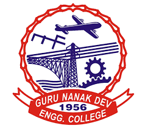

# About my journey at GNDEC:-

#### Day 1
> * 10th July was my first day at the **GNE College**.
> * Our inaugral Day started with Kirtan and Ardass in college's Gurdwara Sahib. After the ardass, there was a tea break organised by the college for almost half an hour.After that inaugral Day started in the college auditorium. Speeches were delivered by our **college principal, H.O.D. ma'am and by the guests of honour**.

#### Day 2 - 11th July
> * We were told about the college societies, clubs and all the facilities provided by college to students. At the end of this day a telegram group **CodeGNE** about coding was created, due to which I am able write here about myself. 

#### Day 3 - 12th July
>    - Ist class - Peer interaction about college. In this class, one of our senior told us about college's website.This class was for about one and half an hour.
>    - 2nd class - It was Mathematics class. Firstly, ma'am took the introduction of the whole class and then taught us **Differentiation**.
>    - After that there was my coding class.

#### Day 4 - 15th July
> This day, it was our turn to sit in the college auditorium.
> * Firstly, **Dr. Randhir Sir** took our session about making account and creating repository on Github.
> * Then, **Dr. Pyare Lal Garg sir**, delivered the speech to the students. He motivated us and inspired us to be consistance in every situation.
> * Our session about setting and achieving future goals by **Dr. Sony goyal**. Also, he toldus how to utilise 4 years of our Degree.
> * Then, one of our senior **Mr. Pancham Ray Singh Gill** told us about non-verbal communication automobile club.
> * Lastly, there was a doubt code session conducted by **CodeGNE** group leaders to take our doubts.

  #### **With that it was the end of my day at GNDEC**.  
